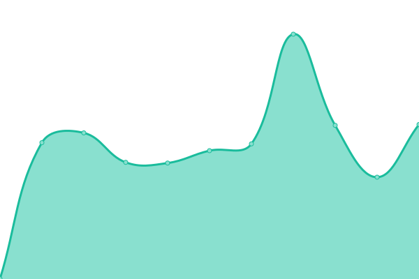

# [📈 Live Status](https://filii-lamberti.github.io/uptime): <!--live status--> **🟧 Partial outage**

This repository contains the open-source uptime monitor and status page for [Filii Lamberti](https://filii-lamberti.github.io/uptime), powered by [Upptime](https://github.com/upptime/upptime).

With [Upptime](https://upptime.js.org), you can get your own unlimited and free uptime monitor and status page, powered entirely by a GitHub repository. We use [Issues](https://github.com/filii-lamberti/uptime/issues) as incident reports, [Actions](https://github.com/filii-lamberti/uptime/actions) as uptime monitors, and [Pages](https://filii-lamberti.github.io/uptime) for the status page.

<!--start: status pages-->
<!-- This summary is generated by Upptime (https://github.com/upptime/upptime) -->
<!-- Do not edit this manually, your changes will be overwritten -->

| URL                                       | Status  | History                                                                                          | Response Time                                                                   | Uptime                                                                                                                                                                                                                           |
| ----------------------------------------- | ------- | ------------------------------------------------------------------------------------------------ | ------------------------------------------------------------------------------- | -------------------------------------------------------------------------------------------------------------------------------------------------------------------------------------------------------------------------------- |
| Confluence                                | 🟩 Up   | [confluence.yml](https://github.com/filii-lamberti/uptime/commits/master/history/confluence.yml) |  734ms |  |
| [Filiikot](https://ishetfiliikotopen.be/) | 🟥 Down | [filiikot.yml](https://github.com/filii-lamberti/uptime/commits/master/history/filiikot.yml)     |  489ms   |       |
| [Website](https://filii.be/)              | 🟩 Up   | [website.yml](https://github.com/filii-lamberti/uptime/commits/master/history/website.yml)       |  766ms    |        |

<!--end: status pages-->

[**Visit our status website →**](https://filii-lamberti.github.io/uptime)

## 📄 License

- Code: [MIT](./LICENSE) © [Filii Lamberti](https://filii-lamberti.github.io/uptime)
- Data in the `./history` directory: [Open Database License](https://opendatacommons.org/licenses/odbl/1-0/)
