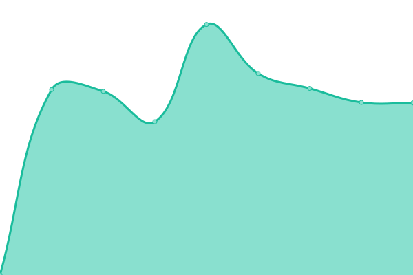

# [📈 Live Status](https://filii-lamberti.github.io/uptime): <!--live status--> **🟧 Partial outage**

This repository contains the open-source uptime monitor and status page for [Filii Lamberti](https://filii-lamberti.github.io/uptime), powered by [Upptime](https://github.com/upptime/upptime).

With [Upptime](https://upptime.js.org), you can get your own unlimited and free uptime monitor and status page, powered entirely by a GitHub repository. We use [Issues](https://github.com/filii-lamberti/uptime/issues) as incident reports, [Actions](https://github.com/filii-lamberti/uptime/actions) as uptime monitors, and [Pages](https://filii-lamberti.github.io/uptime) for the status page.

<!--start: status pages-->
<!-- This summary is generated by Upptime (https://github.com/upptime/upptime) -->
<!-- Do not edit this manually, your changes will be overwritten -->
<!-- prettier-ignore -->
| URL | Status | History | Response Time | Uptime |
| --- | ------ | ------- | ------------- | ------ |
|  Confluence | 🟥 Down | [confluence.yml](https://github.com/filii-lamberti/uptime/commits/HEAD/history/confluence.yml) | 

 0ms
     
 | 

<a href="https://status.filii.be/history/confluence">0.00%</a>
    

|  [Filiikot](https://kot.filii.be/) | 🟥 Down | [filiikot.yml](https://github.com/filii-lamberti/uptime/commits/HEAD/history/filiikot.yml) | 

 0ms
     
 | 

<a href="https://status.filii.be/history/filiikot">0.00%</a>
    

|  [Website](https://filii.be/) | 🟩 Up | [website.yml](https://github.com/filii-lamberti/uptime/commits/HEAD/history/website.yml) | 

 887ms
     
 | 

<a href="https://status.filii.be/history/website">100.00%</a>
    

<!--end: status pages-->

[**Visit our status website →**](https://filii-lamberti.github.io/uptime)

## 📄 License

- Code: [MIT](./LICENSE) © [Filii Lamberti](https://filii-lamberti.github.io/uptime)
- Data in the `./history` directory: [Open Database License](https://opendatacommons.org/licenses/odbl/1-0/)
